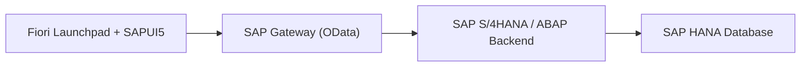

# Complete Guide: Develop a Simple SAP Fiori App

## 1. Introduction
SAP Fiori is SAP’s design system and UX strategy for building modern, role-based, responsive apps across SAP solutions (e.g., SAP S/4HANA). It emphasizes simplicity, consistency, and mobility, and is typically delivered via the SAP Fiori launchpad with UIs built in SAPUI5. [1][2] 

---

## 2. SAP Fiori Architecture
SAP Fiori apps run on a layered architecture: (a) **Frontend** — SAPUI5 app launched from the Fiori launchpad, (b) **Backend** — ABAP/SAP S/4HANA providing business logic, and (c) **OData services** via SAP Gateway bridging UI and backend. [2][3][4]

### Architecture Diagram


**Key components**: SAP Fiori launchpad (shell, tiles/spaces), SAP Gateway (OData), OData services (RESTful APIs), backend CDS/RAP services. [2][3][4]

---

## 3. Steps to Develop a Simple SAP Fiori App
Below is a minimal, end-to-end path using **SAP Business Application Studio (BAS)** and an **OData service** built on CDS. [1][5][6]

### 3.1 Prerequisites
- SAP Business Application Studio (BAS) (or VS Code with Fiori tools) [1]
- Access to an SAP ABAP system (SAP BTP ABAP environment or SAP S/4HANA) [5]
- An OData service (e.g., published from a CDS view) [5][6]

### 3.2 Create a CDS View and Publish OData
Create a CDS view on top of your table and publish it:

```abap
@AbapCatalog.sqlViewName: 'ZBOOK_VIEW'
@EndUserText.label: 'Books'
@OData.publish: true
define view ZI_Book as select from zbook {
  key id,
      title,
      author,
      published_year
}
```

- Activate the CDS view.
- Register and activate the generated OData service in **/IWFND/MAINT_SERVICE** (on-prem) or publish via **Service Binding** (OData V2/V4) in ADT (cloud-ready). [5][6]

### 3.3 Generate the Fiori App (Fiori Elements)
1. Open **BAS** → *Create from Template* → **SAP Fiori elements**.
2. Choose **List Report / Object Page**.
3. Select the OData service and main entity (e.g., `ZI_Book`).
4. Finish the wizard; the generator scaffolds a metadata-driven app. [1][3]

### 3.4 Run and Preview
- Use the BAS preview/run task.
- Verify list and object pages, navigation, and CRUD (if enabled). [1]

### 3.5 Deploy and Integrate
- Deploy to the **SAPUI5 ABAP Repository** (ABAP environment) or to **BTP HTML5 apps repo**.
- Create FLP artifacts (tile/target mapping) and assign to a role/catalog/space for end users. [3]

> **Tip**: If your backend is implemented with **RAP** and you bind an **OData V2/V4 UI service**, Fiori elements understands annotations to render the UI with minimal code. [5][6]

---

## 4. Fiori Elements vs Freestyle SAPUI5
| Aspect | **Fiori Elements** | **Freestyle SAPUI5** |
|---|---|---|
| Approach | Metadata-driven, template-based (List Report, Object Page, etc.) | Full-control coding (XML views/JS controllers) |
| Effort | Lower (leverage annotations) | Higher (custom UI logic/layout) |
| Consistency | High (Fiori design enforced) | Depends on implementation |
| Extensibility | Extension points, local annotations | Unlimited (custom UI patterns) |
| Best for | Standard transactional/analytical apps | Unique UX, complex custom flows |

Fiori tools streamline both flows; choose Elements first when feasible for speed and consistency. [1][3]

---

## 5. Fiori vs RAP: Differences and How They Work Together
| Aspect | **Fiori** | **RAP** |
|---|---|---|
| Role | Frontend **UX** (what users see) | Backend **programming model** (business logic & services) |
| Technology | SAPUI5, Fiori launchpad, OData consumption | ABAP, CDS, **Behavior Definitions/Implementations**, **OData service exposure** |
| Purpose | Build the user interface and interactions | Model data & behavior; expose typed services (OData V2/V4, EML) |
| Integration | Consumes OData | Provides OData UI/Web APIs |

**In practice**: RAP provides the **OData UI service** and semantics (validations, determinations, actions); Fiori elements renders a UI from that metadata. They are complementary, not alternatives. [5][6][7]

---

## 6. Best Practices
- Prefer **Fiori elements** for standard CRUD apps; fall back to freestyle only for exceptional UX needs. [1][3]
- Keep **clean core**: avoid unreleased APIs; expose backend via RAP/CDS and annotations. [5]
- Optimize OData: page, filter, and project fields; avoid chatty calls. [3]
- Use **authorization checks** in CDS/DCL and secure services in Gateway/bindings. [2][3]
- Follow **Fiori design guidelines** for consistent UX and accessibility. [3]
- Test across devices/browsers; leverage **BAS preview** and FLP integration early. [1][3]

---

## 7. References
[1] SAP Help: *Developing SAP Fiori Applications with SAP Fiori Tools* — https://help.sap.com/docs/bas/developing-sap-fiori-app-in-sap-business-application-studio

[2] SAP Help: *SAP Fiori Architecture* — https://help.sap.com/docs/SAP_S4HANA_ON-PREMISE/22bbe89ef68b4d0e98d05f0d56a7f6c8/f009e97dbcc94463aabfac350b09fcf5.html

[3] SAP PRESS Learning/Overview: *SAP Fiori Overview / Tools & Elements* — https://learning.sap-press.com/sap-fiori-overview

[4] SAP Help: *SAP Fiori Applications in the ABAP Environment* — https://help.sap.com/docs/btp/sap-business-technology-platform/sap-fiori-applications-in-abap-environment

[5] SAP Developers Mission: *Build an SAP Fiori App Using RAP (RAP100)* — https://developers.sap.com/mission.sap-fiori-abap-rap100.html

[6] SAP Community: *Fiori List Report App using CDS & Annotations* — https://community.sap.com/t5/technology-blog-posts-by-members/fiori-list-report-application-using-cds-views-and-cds-annotations-with/ba-p/13578380

[7] SAP Community: *End-to-End: Consume RAP in Fiori via BAS* — https://community.sap.com/t5/application-development-and-automation-blog-posts/end-to-end-guide-to-consume-rap-application-to-fiori-using-sap-business/ba-p/13945033

---

> **Note**: The Mermaid diagram renders on platforms that support Mermaid (e.g., GitHub, GitLab, VS Code with plugin). Otherwise, paste it into a Mermaid live editor to export PNG/SVG.
