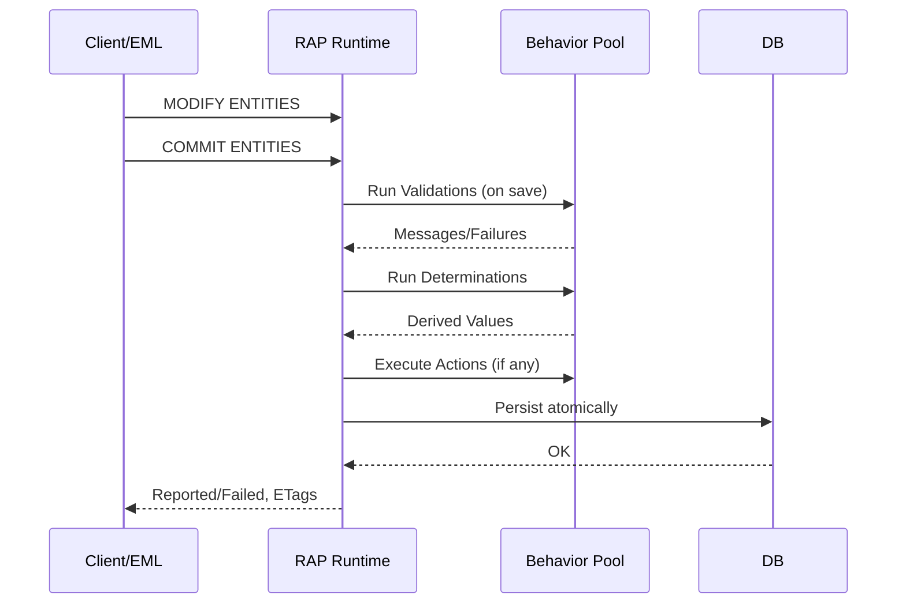

# ABAP RESTful Application Programming Model (RAP) — Complete Guide

> **Purpose**: A comprehensive developer-focused reference to build and operate RAP business objects with proper **transactions**, **draft handling**, **validations & determinations**, **EML**, and a clear **RAP vs BOPF** comparison. Includes copy‑pasteable ABAP snippets and **Mermaid** diagrams.

---

## Table of Contents
- [What is RAP?](#what-is-rap)
- [Key Features](#key-features)
- [Architecture Overview](#architecture-overview)
- [Transactions, Drafts & Concurrency](#transactions-drafts--concurrency)
- [Technical Building Blocks](#technical-building-blocks)
- [Managed vs Unmanaged Implementation](#managed-vs-unmanaged-implementation)
- [Validations & Determinations (Code)](#validations--determinations-code)
- [Entity Manipulation Language (EML) (Code)](#entity-manipulation-language-eml-code)
- [Authorization & Access Control](#authorization--access-control)
- [RAP vs BOPF (Comparison)](#rap-vs-bopf-comparison)
- [Migration Notes (BOPF → RAP)](#migration-notes-bopf--rap)
- [Worked Example: Book Management BO](#worked-example-book-management-bo)
- [References](#references)

---

## What is RAP?
The **ABAP RESTful Application Programming Model (RAP)** is SAP’s modern, cloud‑ready model to build end‑to‑end OData services (Fiori apps and Web APIs) on ABAP. It relies on **CDS view entities** for semantic data modeling, **behavior definitions/implementations** for transactional logic, and **service definition/binding** for protocol exposure (OData V2/V4).

## Key Features
- **End‑to‑end**: CDS → Behavior → Service → Fiori/Web API
- **Transactional**: Atomic save sequence with validations, determinations, actions
- **Draft handling**: Edit/Activate/Discard/Resume/Prepare built‑in
- **Cloud‑ready**: Alignment with **ABAP Cloud** concepts and whitelisted APIs
- **Typed access**: **EML** for direct ABAP access to RAP BOs
- **OData V2/V4**: Service binding supports both (V4 brings modern features)

---

## Architecture Overview
### Components
| Layer | Artifact | Purpose |
|---|---|---|
| Data | **DB tables** | Persistency |
| Domain | **CDS view entities** | Semantic model & projections |
| Behavior | **Behavior definition & Pool** | Declare & implement CRUD, validations, determinations, actions, draft |
| Exposure | **Service definition & binding** | Publish as OData V2/V4 |
| Programmatic | **EML** | Typed ABAP access for read/modify/commit |

#### RAP High‑Level Architecture (Mermaid)
```mermaid
flowchart LR
  subgraph DB[Data Layer]
    T[(Persistence Tables)]
  end
  subgraph ABAP[ABAP Layer]
    CDS[CDS View Entities]
    BEH[Behavior Definition & Pool
(Validations, Determinations, Actions)]
    EML[EML (READ/MODIFY/COMMIT)]
  end
  subgraph SVC[Service Layer]
    SDEF[Service Definition]
    SBND[Service Binding (OData V2/V4)]
  end
  subgraph UI[Client]
    FIORI[Fiori Elements / Web API]
  end

  T <--> CDS
  CDS --> BEH
  EML --> BEH
  CDS --> SDEF --> SBND --> FIORI
```

---
## Transactions, Drafts & Concurrency
- **Transactional Buffer & Save Sequence**: Changes live in a buffer. `COMMIT ENTITIES` runs **Validations → Determinations → Actions → Persist** atomically.
- **Draft Handling**: Enable **`with draft`** and get built‑in actions: **Edit**, **Activate** (optimized variant available), **Discard**, **Resume**, and **Prepare**.
- **Optimistic Locking / ETags**: Define **`etag master ...`** in BDEF and use **lock master** to protect the lockable subtree.

##### Save Sequence (Simplified)


---

## Technical Building Blocks
- **Behavior Definition (BDEF)**: Declares operations, field control, **validations/determinations**, **actions**, draft, locking, and **ETag**.
- **Behavior Pool (ABP)**: Implements handler methods; can use EML and `IN LOCAL MODE` when called from within the same pool (develop scenario).
- **Service Definition/Binding**: Clean separation of model vs exposure; supports OData V2/V4.

---

## Managed vs Unmanaged Implementation
- **Managed**: Framework handles CRUD & save; ideal for greenfield—focus on business logic via determinations/validations/actions.
- **Unmanaged**: You implement CRUD/save yourself (e.g., wrap legacy BAPIs); ideal for brownfield.
- **Feature availability**: RAP adds OData V4 and modern draft features; see SAP’s matrix comparing RAP, BOPF, and Gateway.

---
## Validations & Determinations (Code)
Below shows a **managed + draft** root entity `ZI_Book` with a validation and a determination.

### Behavior Definition (BDEF)
```abap
managed implementation in class lhc_Book unique;
with draft;

define behavior for ZI_Book alias Book
  persistent table zbook
  lock master
  etag master last_changed_at
  authorization master ( instance )
{
  create;
  update;
  delete;

  field ( mandatory ) title, author;

  validation ValidateYear on save { field published_year; }
  determination SetDefaults on modify { create; }

  action Publish result [1] $self;
}
```

### Behavior Implementation (ABP Handler)
```abap
CLASS lhc_Book DEFINITION INHERITING FROM cl_abap_behavior_handler.
  PRIVATE SECTION.
    METHODS ValidateYear FOR VALIDATION Book~ValidateYear IMPORTING keys FOR Book.
    METHODS SetDefaults FOR DETERMINATION Book~SetDefaults IMPORTING keys FOR Book.
    METHODS Publish     FOR ACTION      Book~Publish     IMPORTING keys FOR Book RESULT result.
ENDCLASS.

CLASS lhc_Book IMPLEMENTATION.
  METHOD ValidateYear.
    READ ENTITIES OF ZI_Book IN LOCAL MODE
      ENTITY Book
        FIELDS ( published_year )
        WITH CORRESPONDING #( keys )
      RESULT DATA(books).

    DATA(current_year) = cl_abap_context_info=>get_system_date( )(1:4).

    LOOP AT books ASSIGNING FIELD-SYMBOL(<b>).
      IF <b>-published_year IS INITIAL OR <b>-published_year > current_year.
        APPEND VALUE #( %tky = <b>-%tky
                         %msg = new_message_with_text( severity = if_abap_behv_message=>severity-error
                                                        text     = |Published year is invalid.| ) )
               TO reported-Book.
        APPEND VALUE #( %tky = <b>-%tky ) TO failed-Book.
      ENDIF.
    ENDLOOP.
  ENDMETHOD.

  METHOD SetDefaults.
    MODIFY ENTITIES OF ZI_Book IN LOCAL MODE
      ENTITY Book
        UPDATE FIELDS ( created_at created_by )
        WITH VALUE #( FOR key IN keys
                      ( %tky = key-%tky
                        created_at = cl_abap_context_info=>get_system_time( )
                        created_by = cl_abap_context_info=>get_user_technical_name( ) ) ).
  ENDMETHOD.

  METHOD Publish.
    result = VALUE #( FOR key IN keys ( %tky = key-%tky ) ).
  ENDMETHOD.
ENDCLASS.
```

---

## Entity Manipulation Language (EML) (Code)
**Create + Commit** (typed EML):
```abap
MODIFY ENTITIES OF ZI_Book
  ENTITY Book
    CREATE FROM VALUE #(
      ( %cid = 'NEW1' title = 'Clean ABAP' author = 'SAP' published_year = 2020 ) )
  MAPPED   DATA(mapped)
  FAILED   DATA(failed)
  REPORTED DATA(reported).

COMMIT ENTITIES RESPONSE OF ZI_Book
  FAILED   DATA(failed_commit)
  REPORTED DATA(reported_commit).
```

**Execute an Action**:
```abap
MODIFY ENTITIES OF ZI_Book
  ENTITY Book
    EXECUTE Publish FROM VALUE #( ( %tky-%key-id = '0000000001' ) )
  RESULT DATA(action_result)
  FAILED DATA(failed2)
  REPORTED DATA(reported2).
```

---
## Authorization & Access Control
- In CDS: `@AccessControl.authorizationCheck: #CHECK` + DCL to restrict access.
- In BDEF: `authorization master ( instance )`; for drafts, apply feature control to `Edit` when needed.
- For **ABAP Cloud**, consume only **released** APIs and BO interfaces.

---

## RAP vs BOPF (Comparison)
| Aspect | RAP | BOPF / ABAP Programming Model for Fiori |
|---|---|---|
| Service Exposure | **Service Definition + Binding** (OData V2/V4) | Mostly OData V2 via Gateway |
| Transaction Engine | Managed runtime + **EML**, built‑in **draft** | BOPF engine; draft via Fiori programming model |
| Programming Model | **CDS View Entities + Behavior (BDEF/ABP)** | **CDS + BOPF BO** + generated artifacts |
| Cloud Readiness | Part of **ABAP Cloud**; whitelisted APIs | Pre‑cloud; migrate to align |
| Concurrency | ETags in BDEF; lock master | BOPF mechanisms |
| Developer Access | Typed **EML** | BOPF Service Manager / APIs |
| Feature Matrix | Adds OData V4, modern features | Earlier model |

---

## Migration Notes (BOPF → RAP)
- **ADT Wizard**: Convert **CDS‑based BOPF BOs** to RAP BOs (simulate/migrate). Enablement may require SAP note/component activation.
- **Caveat**: Wizard may produce **BOPF‑based RAP BOs** (not fully native RAP) and might not be suitable for ABAP Cloud enablement; remodel to native RAP where feasible.
- **Why migrate**: EML access, OData V2/V4 exposure, RAP events, and strategic alignment with ABAP Cloud.

---

## Worked Example: Book Management BO

### CDS View Entity (root)
```abap
@EndUserText.label: 'Book'
@AccessControl.authorizationCheck: #CHECK
@Metadata.allowExtensions: true
define root view entity ZI_Book
  as select from zbook
{
  key id              : abap.numc(10),
      title           : abap.char(120),
      author          : abap.char(60),
      published_year  : abap.int4,
      created_at      : abap.tims,
      created_by      : abap.syuname,
      last_changed_at : abap.tims
}
```

### Behavior Definition (minimal)
```abap
managed implementation in class lhc_Book unique;
with draft;

define behavior for ZI_Book alias Book
  persistent table zbook
  lock master
  etag master last_changed_at
{
  create; update; delete; draft;
}
```

### Service Definition
```abap
define service ZUI_BOOK {
  expose ZI_Book as Book;
}
```
> Bind `ZUI_BOOK` to **OData V4** in Service Binding to generate a Fiori elements UI quickly.

---
## References
- **ABAP RAP – Help Portal (ABAP Cloud)** — https://help.sap.com/docs/abap-cloud/abap-rap/abap-restful-application-programming-model
- **Learn (Design/Runtime views)** — https://help.sap.com/docs/abap-cloud/abap-rap/learn
- **Entity Manipulation Language (EML)** — https://help.sap.com/docs/abap-cloud/abap-rap/entity-manipulation-language-eml
- **ABAP RESTful Programming Model (Guide/PDF)** — https://help.sap.com/doc/7dc426856bc640bf98e9e345a0736cf4/1909%20FPS00/en-US/ABAP_RESTful_Programming_Model_On-Premise_EN.pdf
- **Draft Actions** — https://help.sap.com/docs/abap-cloud/abap-rap/draft-actions and ABAP doc — https://help.sap.com/doc/abapdocu_latest_index_htm/latest/en-US/abenbdl_draft_action.htm
- **Validations (ABAP Docu)** — https://help.sap.com/doc/abapdocu_cp_index_htm/CLOUD/en-US/ABENBDL_VALIDATIONS.html
- **Getting Started (SAP Community, updated 2024)** — https://community.sap.com/t5/technology-blog-posts-by-sap/getting-started-with-the-abap-restful-application-programming-model-rap/ba-p/13420829
- **Business Object Implementation Types (Managed vs Unmanaged)** — https://help.sap.com/docs/abap-cloud/abap-rap/business-object-implementation-types
- **Feature Matrix: RAP vs BOPF vs Gateway** — https://community.sap.com/t5/technology-blog-posts-by-sap/compact-feature-availability-matrix-of-abap-programming-models-rap-vs-bopf/ba-p/13496369
- **What is RAP? (SAP PRESS blog)** — https://blog.sap-press.com/what-is-the-restful-abap-programming-model

---

> **Usage**: This file keeps Markdown formatting so diagrams and code render nicely on GitHub/GitLab or VS Code with Mermaid enabled. For platforms that don’t support Mermaid, copy the diagram blocks into a Mermaid live editor to export PNG/SVG.
