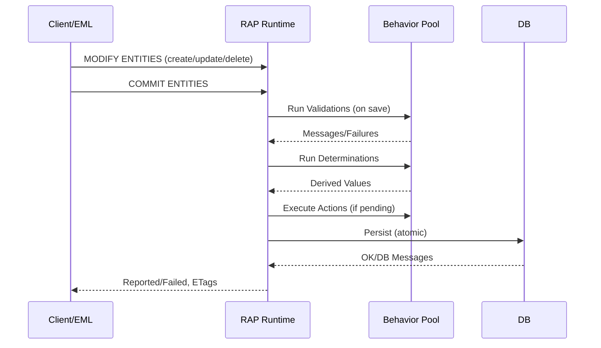

# ABAP RESTful Application Programming Model (RAP) — Complete Guide

> **Purpose**: A compact, developer-focused reference for RAP with transactions, draft handling, validations & determinations, EML usage, and a concise RAP vs BOPF comparison. Includes copy‑pasteable code and diagrams in Markdown.

---

## Table of Contents
- [What is RAP?](#what-is-rap)
- [Architecture Overview](#architecture-overview)
- [Transactions, Drafts & Concurrency](#transactions-drafts--concurrency)
- [Technical Building Blocks](#technical-building-blocks)
- [Managed vs Unmanaged Implementation](#managed-vs-unmanaged-implementation)
- [Validations & Determinations (Code)](#validations--determinations-code)
- [Entity Manipulation Language (EML) (Code)](#entity-manipulation-language-eml-code)
- [Authorization & Access Control](#authorization--access-control)
- [RAP vs BOPF (Comparison)](#rap-vs-bopf-comparison)
- [Migration Notes (BOPF → RAP)](#migration-notes-bopf--rap)
- [Worked Example: Book Management BO](#worked-example-book-management-bo)
- [Diagrams](#diagrams)
- [Further Reading](#further-reading)

---

## What is RAP?
The **ABAP RESTful Application Programming Model (RAP)** is SAP’s modern, cloud‑ready programming model to build end‑to‑end OData services (Fiori apps and Web APIs) on the ABAP stack. It is based on CDS for semantic data models, behavior definitions/implementations for transactional logic, and service definition/binding for exposure (OData V2/V4). citeturn3search25

RAP provides a typed, programmatic access to business objects via **Entity Manipulation Language (EML)** so you can consume and orchestrate BOs directly from ABAP code, in addition to OData. citeturn3search13

---

## Architecture Overview
**Layers & Artifacts**

- **Database / Tables** → Persistency layer. citeturn3search27
- **CDS View Entities** → Domain model & projections. citeturn3search25
- **Behavior Definition & Pool** → CRUD, validations, determinations, actions. citeturn3search26
- **Service Definition** → Expose BO entities. citeturn3search25
- **Service Binding (OData V2/V4)** → Protocol binding for Fiori/Web APIs. citeturn3search25
- **EML** → Typed ABAP access for read/modify & save sequence. citeturn3search13

> See [Diagrams](#diagrams) for a visual overview. citeturn3search27

---

## Transactions, Drafts & Concurrency
- **Transactional Buffer & Save Sequence**: RAP collects changes in a transactional buffer and on `COMMIT ENTITIES` executes **validations → determinations → actions → save** atomically. citeturn3search13
- **Draft Handling**: Built‑in draft actions (`Edit`, `Activate`, `Discard`, `Resume`, `Prepare`) support partial saves and UX like autosave and staged activation. citeturn3search22turn3search21
- **Validations**: Triggered on save based on operations/field changes; can reject inconsistent instances and return messages. citeturn3search23
- **Determinations**: Compute/derive values on create/update or `prepare`. (See code below.) citeturn3search26
- **Optimistic Concurrency**: Use ETag (`etag master ...`) for conflict detection in behavior definition. citeturn3search25

---

## Technical Building Blocks
- **Managed vs Unmanaged BOs**: Both use CDS models; managed delegates standard CRUD & save to RAP provider, unmanaged requires explicit implementation. citeturn3search9
- **Behavior Definition (BDEF)**: Declares operations, field control, validations, determinations, actions, draft handling, locking, and ETags. citeturn3search26
- **Behavior Pool (ABP)**: ABAP class implementing handler methods for validations/determinations/actions; can use EML and `IN LOCAL MODE` in develop scenarios. citeturn3search13
- **Service Definition/Binding**: Expose entities and bind to OData (V2/V4). citeturn3search25

---

## Managed vs Unmanaged Implementation
- **Managed**: Best for greenfield; framework handles transactional engine, you focus on business logic via determinations, validations, and actions. citeturn3search9
- **Unmanaged**: Best for brownfield/legacy reuse; you implement CRUD & save manually (e.g., wrapping BAPIs) within behavior pool. citeturn3search9
- **Feature Matrix & Availability**: RAP supports OData V4 & draft (esp. in recent S/4HANA releases/BTP); BOPF largely OData V2; see feature matrix. citeturn3search7

---

## Validations & Determinations (Code)
Below is a minimal **managed with draft** example for a root entity `ZI_Book`.

### Behavior Definition (BDEF)
```abap
managed implementation in class lhc_Book unique;
with draft;

define behavior for ZI_Book alias Book
  persistent table zbook
  lock master
  etag master last_changed_at
  authorization master ( instance )
{
  create;
  update;
  delete;

  field ( mandatory ) title, author;

  validation ValidateYear on save { field published_year; }
  determination SetDefaults on modify { create; }

  action Publish result [1] $self;
}
```

### Behavior Implementation (ABP Handler)
```abap
CLASS lhc_Book DEFINITION INHERITING FROM cl_abap_behavior_handler.
  PRIVATE SECTION.
    METHODS ValidateYear FOR VALIDATION Book~ValidateYear IMPORTING keys FOR Book.
    METHODS SetDefaults FOR DETERMINATION Book~SetDefaults IMPORTING keys FOR Book.
    METHODS Publish     FOR ACTION      Book~Publish     IMPORTING keys FOR Book RESULT result.
ENDCLASS.

CLASS lhc_Book IMPLEMENTATION.
  METHOD ValidateYear.
    READ ENTITIES OF ZI_Book IN LOCAL MODE
      ENTITY Book
        FIELDS ( published_year )
        WITH CORRESPONDING #( keys )
      RESULT DATA(books).

    DATA(current_year) = cl_abap_context_info=>get_system_date( )(1:4).

    LOOP AT books ASSIGNING FIELD-SYMBOL(<b>).
      IF <b>-published_year IS INITIAL OR <b>-published_year > current_year.
        APPEND VALUE #( %tky = <b>-%tky
                         %msg = new_message_with_text( severity = if_abap_behv_message=>severity-error
                                                        text     = |Published year is invalid.| ) )
               TO reported-Book.
        APPEND VALUE #( %tky = <b>-%tky ) TO failed-Book.
      ENDIF.
    ENDLOOP.
  ENDMETHOD.

  METHOD SetDefaults.
    MODIFY ENTITIES OF ZI_Book IN LOCAL MODE
      ENTITY Book
        UPDATE FIELDS ( created_at created_by )
        WITH VALUE #( FOR key IN keys
                      ( %tky = key-%tky
                        created_at = cl_abap_context_info=>get_system_time( )
                        created_by = cl_abap_context_info=>get_user_technical_name( ) ) ).
  ENDMETHOD.

  METHOD Publish.
    " Custom action logic; here we just echo $self
    result = VALUE #( FOR key IN keys ( %tky = key-%tky ) ).
  ENDMETHOD.
ENDCLASS.
```

> Validations are triggered *on save* and can block the transaction; determinations run on specified triggers (create/update/prepare). citeturn3search23turn3search26

---

## Entity Manipulation Language (EML) (Code)
**Create + Commit** (typed EML, managed scenario):
```abap
MODIFY ENTITIES OF ZI_Book
  ENTITY Book
    CREATE FROM VALUE #(
      ( %cid = 'NEW1' title = 'Clean ABAP' author = 'SAP' published_year = 2020 ) )
  MAPPED   DATA(mapped)
  FAILED   DATA(failed)
  REPORTED DATA(reported).

COMMIT ENTITIES RESPONSE OF ZI_Book
  FAILED   DATA(failed_commit)
  REPORTED DATA(reported_commit).
```

**Execute Action**:
```abap
MODIFY ENTITIES OF ZI_Book
  ENTITY Book
    EXECUTE Publish FROM VALUE #( ( %tky-%key-id = '0000000001' ) )
  RESULT DATA(action_result)
  FAILED DATA(failed2)
  REPORTED DATA(reported2).
```

> EML provides typed ABAP statements to **READ/MODIFY** entities and to trigger the **save sequence** via `COMMIT ENTITIES`. `IN LOCAL MODE` bypasses authorization/feature checks when used inside the same behavior pool (develop scenario). citeturn3search13turn3search15

---

## Authorization & Access Control
- In CDS: `@AccessControl.authorizationCheck: #CHECK` and DCL rules to restrict access. citeturn3search26
- In BDEF: `authorization master ( instance )` and, for drafts, feature control on `Edit`. citeturn3search21
- For ABAP Cloud, prefer released APIs/whitelisted contracts; avoid unreleased calls. citeturn3search25turn3search4

---

## RAP vs BOPF (Comparison)
| Aspect | RAP | BOPF / ABAP Prog. Model for Fiori |
|---|---|---|
| Service Exposure | Service Definition + Binding (OData V2/V4) | Typically OData V2 via SAP Gateway |
| Transaction Engine | Managed runtime with typed EML; draft built‑in | BOPF engine; draft available in programming model for Fiori |
| Programming Model | CDS View Entities + Behavior Definition/Pool | CDS + BOPF BO + Generated artifacts |
| Cloud Readiness | Part of **ABAP Cloud**; whitelisted APIs | On‑prem first; cloud alignment via migration |
| Concurrency | ETags in BDEF | Handled via BOPF mechanisms |
| Developer Access | **EML** (typed ABAP) for programmatic access | BOPF Service Manager/APIs |
| Migration | Guided migration (CDS‑based BOPF → RAP) exists (wizard) | — |

**Notes & Sources**: Feature availability matrix and evolution are documented by SAP; RAP adds OData V4 and modern cloud tooling, while BOPF is the predecessor used by the ABAP Programming Model for Fiori. citeturn3search7turn3search25

---

## Migration Notes (BOPF → RAP)
- **ADT Wizard**: A migration wizard exists in ADT (simulate or migrate) for **CDS‑based BOPF BOs**. Activation may require SAP note/component enablement. citeturn3search31turn3search32
- **Caveat**: The wizard produces **BOPF‑based RAP BOs** (not native RAP) and isn’t recommended for ABAP Cloud enablement; consider remodeling to native RAP where possible. citeturn3search33
- **Why migrate**: Access via EML, V2/V4 service exposure, RAP events, and alignment with SAP’s strategic model. citeturn3search32

---

## Worked Example: Book Management BO

### CDS View Entity (root)
```abap
@EndUserText.label: 'Book'
@AccessControl.authorizationCheck: #CHECK
@Metadata.allowExtensions: true
define root view entity ZI_Book
  as select from zbook
{
  key id              : abap.numc(10),
      title           : abap.char(120),
      author          : abap.char(60),
      published_year  : abap.int4,
      created_at      : abap.tims,
      created_by      : abap.syuname,
      last_changed_at : abap.tims
}
```

### Behavior Definition (see full version earlier)
```abap
managed implementation in class lhc_Book unique;
with draft;

define behavior for ZI_Book alias Book
  persistent table zbook
  lock master
  etag master last_changed_at
{
  create; update; delete; draft;
}
```

### Service Definition & Binding
```abap
define service ZUI_BOOK {
  expose ZI_Book as Book;
}
```
Bind `ZUI_BOOK` to **OData V4** in Service Binding to generate a Fiori elements UI quickly. citeturn3search25

---

## Diagrams

### RAP High‑Level Architecture
```mermaid
flowchart LR
  subgraph DB[Data Layer]
    T[(ZBOOK Table)]
  end
  subgraph ABAP[ABAP Layer]
    CDS[CDS View Entity <br/>ZI_Book]
    BEH[Behavior Def & Pool <br/>(Validations/Determinations/Actions)]
    EML[EML Access <br/>(READ/MODIFY/COMMIT)]
  end
  subgraph SVC[Service Layer]
    SDEF[Service Definition]
    SBND[Service Binding <br/>(OData V2/V4)]
  end
  subgraph UI[Client]
    FIORI[Fiori Elements App / Web API]
  end

  T <--> CDS
  CDS --> BEH
  EML --> BEH
  CDS --> SDEF --> SBND --> FIORI
```
*Concept aligns with SAP Help diagrams of design/runtime perspectives.* citeturn3search27

### RAP Save Sequence (Simplified)

*Sequence based on RAP transactional phases and `COMMIT ENTITIES` semantics.* citeturn3search13

---

## Further Reading
- **ABAP RAP – Help Portal (ABAP Cloud)**: Overview, architecture, guides. citeturn3search25
- **Learn Section (Design/Runtime views)**. citeturn3search27
- **EML Official Docs**. citeturn3search13
- **Draft Actions**. citeturn3search22
- **Validations (ABAP Docu)**. citeturn3search23
- **Implementation Types (Managed vs Unmanaged)**. citeturn3search9
- **Feature Matrix: RAP vs BOPF vs Gateway**. citeturn3search7
- **Getting Started (SAP Community overview, updated 2024)**. citeturn3search30

---

